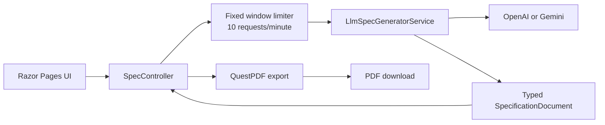

# SpecBridge AI

SpecBridge turns informal product requirements into a structured BRD/SRS-style specification. It identifies functional requirements, non-functional requirements, user stories, open discovery gaps, and delivery risks through an OpenAI- or Gemini-compatible provider.

## Architecture



## Local setup

Prerequisites: .NET 8 SDK and an API key for OpenAI or Gemini.

```powershell
dotnet restore
dotnet user-secrets set "Llm:Provider" "openai"
dotnet user-secrets set "Llm:ApiKey" "your-api-key"
dotnet run --launch-profile http
```

For Gemini, use `gemini` as the provider. Optional model and endpoint settings are available in `appsettings.json` and can also be stored in User Secrets.

Run the verification suite with:

```powershell
dotnet test Tests/SpecBridge.Tests.csproj
```

## API

### `POST /api/generate-spec`

Request:

```json
{
  "prompt": "We need a leave management system with manager approvals and email notifications."
}
```

The endpoint returns a `SpecResponse` containing a typed `SpecificationDocument`. Prompts must be non-empty and no longer than 20,000 characters. Requests are limited to 10 per minute with a fixed-window rate limiter.

### `POST /api/export-pdf`

Send the `specification` object from the generation response as JSON. The endpoint returns `specbridge-specification.pdf` with section headings, requirement lists, and page numbers.

## Security baseline

The application adds CSP, `X-Frame-Options`, `X-Content-Type-Options`, `Referrer-Policy`, and HSTS on HTTPS responses. Provider credentials are read from User Secrets and are never stored in the repository.

## Project structure

- `Controllers/`: API endpoints and request orchestration.
- `Models/`: request, response, and specification contracts.
- `Services/`: LLM and PDF implementations.
- `Pages/` and `wwwroot/`: Razor UI and browser rendering.
- `Tests/`: integration checks for headers, rate limiting, and model parsing.
